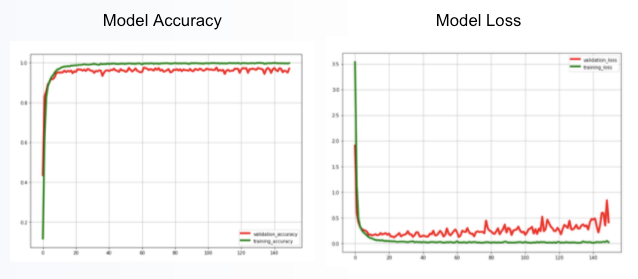

# Project 2 - AI Machine Learning Fintech

Data Sources:
* ASL Digit pictures dataset source: https://www.kaggle.com/orhansertkaya/convolutional-neural-network-sign-language-digits.  However these are 64x64 pixel pictures in numpy array.
* ASL Alphabet pictures dataset source: https://www.kaggle.com/datamunge/sign-language-mnist?select=sign_mnist_test. However these are 28x28 pixel pictures in csv format.

---
## Project Goal:

Train a machine learning model to successfully recognise American Sign Language alphabet and digit hand signals.

## Methodology:

- Build initial Machine Learning model to successfully recognise ASL digit hand signals. (10 symbols).

- Determine if the model can be re-fit for both ASL alphabet & digit hand signals. 
(34 symbols.  The symbols for J and Z are excluded as they are movement based.)

- Test additional hand pictures to see how model responds to other hand shapes.

## Instructions:

In order to run the model, you will need to create an 'input' folder and add 4 datasets (X.npy, Y.npy, sign_mnist_test.csv and sign_mnist_train.csv) in it. Then under the input folder, create a subfolder called 'New_Pictures', and put the additional pictures in that new folder.

## Digits Model:

In this section, we have used a dataset of 2062 images of ASL digit hand symbols, 64 x 64 pixel black and white images and 80/20 train vs test split.

### Structure Digits Model:

### New Model Used - CNN: 
A convolutional layer contains a set of parameters that need to be learned. Each filter is convolved with the input volume to compute an activation map. The activation map is slid across the width and height of the input in a "pool size" set in the model architecture with the weights computed at every spatial position.

### Digits Model Validation:
After 100 epochs, validation accuracy at 97%+ and validation loss at 11%.

### Digits Model Confusion Matrix:

## Alphabet Dataset:

In this section, we have first used a dataset of 34,627 images of ASL alphabet hand symbols, 28 x 28 pixel black and white images, in csv format, and the train vs test split were 80/20.

Then, we had to transform the dataset as required with Pixel values adjusted from 0-255 to between 0-1, One hot encoding of y class, image augmentation (features standardisation to rebalance lighter or darker images, ZCA whitening which highlighted the image outlines, random rotations, flips, and shifts). We also resized images to 64 x 64 pixel values using the Pillow function.

  

## Combined Alphabet & Digits Model:

In this section, we have combined the two dataset ASL digit and alphabet hand symbols with 36,684 images in total. The data was amended to numpy array using block_diag to join the 2 datasets. The train vs test split were 80/20.

Finally, we used the same structure and compile as Digits model.

### Model Validation:
After 150 epochs, validation accuracy at 97%+ and validation loss at 40%.

### Model Confusion Matrix:

The confusion matrix indicates there are a few areas where the model has issues predicting the correct classification:
 - Actual value 12 (N) gets confused with predicted value 11 (M) (confusion matrix score 41).
 - Actual value 19 (U) gets confused with predicted value 16 (R) (cm score 23).
 - Actual value 20 (V) gets confused with predicted value 19 (U) (cm score 19).
 - Actual value 9 (K) gets confused with predicted value 19 (Y) (cm score 19).
 - Actual value 9 (K) gets confused with predicted value 7 (H) (score 21).

On reviewing the hand signals for these outputs, there are some similarities between N and M, and U and R as well as V and U.  
The confusion between K and Y, and K and H may be due to the image augmentation rotations and flips used.  A future test would be to remove the image augmentation rotations and flips and retest the model.

(Refer Appendix - for mapping of confusion matrix values to alphabet and digits.)

## Testing Our Model with Additional Images:
We further tested our model by providing it with additional input / images in new formats which the model had not previously seen.

### Image # 1

The image of a cartoon hand was expected to output a 5, however the model outputted A.  This could be due to the model mistaking the chubby fingers as a closed fist, rather than outstretched fingers.

### Image # 2

The drawn skeleton hand was in a style very unfamiliar to the model.  Rather than outputting a 5 as expected, the model outputted a V.

### Image # 3

The four fingered hand was mistaken by the model to be a Q, rather than the 4 output expected.

### Image # 4

The mannequin hand was expected to ouput a F.  The model outputted a C.  This was considered a fairly close outcome, as the key difference between an F and a C is in the size of gap between the thumb and index finger.

### Image # 5

The O handshape was correctly interpreted by the model.  This was pleasing, as many of the training images showed the hand signal from a front position, where the O shape in the fingers was not very clear.

## Learnings:

Data integrity - We encountered some issues with the labelling and ordering of data which gave us incorrect output on the trained model. In order to rectify it, we had to adjust our code accordingly to align with the dataset. We also realised the low resolution version of the images perhaps made it difficult for the model to accurately recognize the images. One of the key learnings for us was to ensure that we should go through our dataset quite rigorously before using it for machine learning.
 
Significant difference in model accuracy output between running on own computer vs running on Google Colab - this was perhaps due to Google Colab using more advanced versions of Machine Learning software & imports available.
 
Colab run models may not be compatible to your computer - we struggled to run notebooks that were created on Jupyter Lab and encountered compatibility issues when we tried to upload it on Colab.
 
Early stopping of epochs - When we tried to train model3 (alphabet & digits model), we realised that after a particular number of epochs, the validation-accuracy score started to decrease and the losses started to increase. Through trial and error, we found stopping at an earlier number of epochs would prevent the model from overfitting.

## Appendix:

For Confusion Matrix, mapping of output value to alphabet and digits (note the numbers are not in chronological order):

Output # : Value  
0 : A,   
1 : B,   
2 : C,   
3 : D,   
4 : E,   
5 : F,   
6 : G,   
7 : H,   
8 : I,   
9 : K,   
10 : L,   
11 : M,   
12 : N,   
13 : O,   
14 : P,   
15 : Q,   
16 : R,   
17 : S,   
18 : T,   
19 : U,   
20 : V,   
21 : W,   
22 : X,   
23 : Y,   
24 : 9,   
25 : 0,   
26 : 7,   
27 : 6,   
28 : 1,   
29 : 8,   
30 : 4,   
31 : 3,   
32 : 2,   
33 : 5.  
